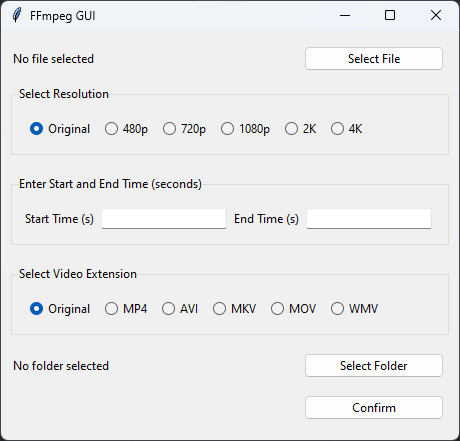

# FFmpeg GUI

## 概要

話題のGPT-4oを使ってコーディングしました。GUIからFFmpegを呼び出すソフトです。実装にはPython標準のTkinterを使っているため特にインストールなしで使えます。

## 使い方

FFmpegの標準的なインストールとPathが通っていることを確認してください。このプログラム自体は特に処理をせず、インストール済みのFFmpegを呼び出すのみです。

### 動作確認

||Version|
|----|----|
|Windows|23H2|
|Python|3.12.3|
|FFmpeg|N-115257-g8c21f1e3b7-20240518|

